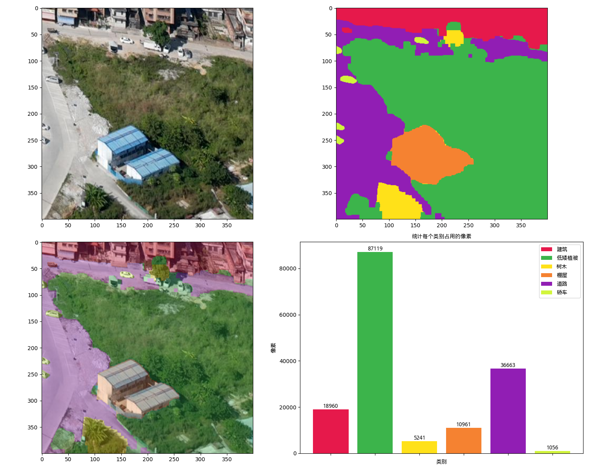

## Panorama_SAM：基于SAM-DINO-CLIP组合模型实现全景图场景下的地物分类和实例分割
---


## 目录
1. [项目介绍 Introduction](#项目介绍)
2. [快速启动 QuickStart](#快速启动)
3. [自定义提示 How2customise](#自定义提示)
4. [参考资料 Reference](#参考资料)


## 项目介绍
在网络数据集上预训练的大数据模型具有强大的zero-shot(零样本)和few-shot(少样本)泛化能力，这些"基础模型"可以推广到超出训练过程中的任务和数据分布，使用网络上的大量图像数据进行增广和训练后，发现这种零样本和少样本的训练的模型比微调模型效果还要好，数据集越大，效果越明显。
此类模型的能力通过`prompt engineering`实现，具体就是输入提示得到相对应的输出。

MetaAI于2023年4月份发布的Segment Anything Model(SAM)模型便可通过提示语生成image encoder，并扩展到图像分割任务，达到分割一切的效果，其中提示可以是点，矩形框和掩码。

然而SAM模型不具备文本识别和语义分析能力，无法识别分割对象的类别，因此在很多应用上不具有实用性，本项目在SAM模型的基础上，结合Grounding DINO模型和CLIPSeg模型实现全景图场景下的地物分类和实例分割。
* Grounding DINO：zero-shot目标检测模型，可通过文本提示实现多目标检测，生成目标矩形框。
* CLIPSeg：zero-shot语义分割模型，可通过文本提示实现图像的二分类区域分割，生成掩码。

获取Grounding DINO模型和CLIPSeg模型生成的矩形框和掩码信息，可作为SAM模型的提示，实现全景分割。

## 快速启动
1. 配置`python>=3.8`的运行环境，安装pytorch和其他工具包
2. 下载模型权重和配置文件，并解压至根目录。链接：https://pan.baidu.com/s/1mfNHc4CVGFjKcq-nLIzt7w 提取码：rrm8
3. 运行main.py
```python
# 安装pytorch
pip install torch==1.8.0+cu111 torchvision==0.9.0+cu111 torchaudio==0.8.0 -f https://download.pytorch.org/whl/torch_stable.html
# 安装工具包
pip install -i https://pypi.tuna.tsinghua.edu.cn/simple opencv-python matplotlib scipy supervision transformers timm addict yapf
```

## 自定义提示
模型会根据不同的提示文本，生成不同的掩码，可修改main.py中的category_cfg变量，自定义提示文本。
* landcover_prompts为地物分类的提示，在全景图场景下一般用于分割区域连续或较大的类别
* cityobject_prompts为实例分割的提示，在全景图场景下一般用于图像内区域不连续的对象类别
* landcover_prompts_cn和cityobject_prompts_cn为每个类别的中文含义
```python
category_cfg = {
    "landcover_prompts": ['building', 'low vegetation', 'tree', 'river', 'shed', 'road', 'lake', 'bare soil'],
    "landcover_prompts_cn": ['建筑', '低矮植被', '树木', '河流', '棚屋', '道路', '湖泊', '裸土'],
    "cityobject_prompts": ['car', 'truck', 'bus', 'train', 'ship', 'boat'],
    "cityobject_prompts_cn": ['轿车', '卡车', '巴士', '列车', '船(舰)', '船(舶)']
}
```

## 参考资料
1. SAM模型：https://github.com/facebookresearch/segment-anything
2. Grounding DINO模型：https://github.com/IDEA-Research/GroundingDINO
3. CLIPSeg模型：https://huggingface.co/blog/clipseg-zero-shot